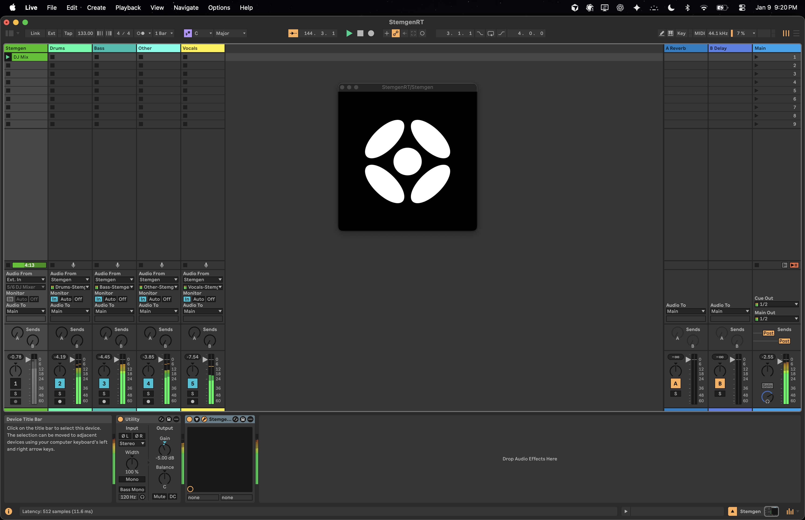

# StemgenRT

A real-time low-latency music source separation plugin. Drop it on a track and get 4 separate stems: drums, bass, other, and vocals.

With a latency of 11.6 milliseconds, it is made for spatializing DJ sets in real-time: split the mix into stems, place them in the room, and create an immersive experience.

Built with [JUCE](https://github.com/juce-framework/JUCE) and [ONNX Runtime](https://onnxruntime.ai), using [HS-TasNet](https://github.com/sweetspotsoundsystem/HS-TasNet).

Available as VST3 and AU.



## Usage

StemgenRT is a multi-output plugin with 4 stereo output buses:

1. **Drums**
2. **Bass**
3. **Other** (synths, guitars, etc.)
4. **Vocals**

To set it up:

1. Insert StemgenRT on your source track (e.g., a DJ mix or full song)
2. Create 4 auxiliary/bus tracks to receive each stem
3. Route each of the plugin's outputs to its corresponding aux track

Check your DAW's documentation for multi-output plugin routing.

## Downloads

Coming soon.

## Building

First, grab the ONNX Runtime dependency:

```bash
# macOS
./scripts/download-onnxruntime.sh

# Windows (PowerShell)
./scripts/download-onnxruntime.ps1
```

Then build with CMake:

```bash
cmake -S . -B build
cmake --build build
```

For a release build:

```bash
cmake -S . -B build-release
cmake --build build-release
```

## How it works

The plugin runs a neural network to separate audio, but neural networks are slow and audio callbacks are fast. To bridge the gap:

1. **Audio thread** collects incoming samples and feeds them to a ring buffer
2. **Inference thread** runs the model asynchronously in the background
3. **Audio thread** picks up the processed stems when ready

If inference can't keep up, the plugin gracefully crossfades to the dry signal rather than glitching.

A few DSP tricks help the model out:

- **80Hz crossover** — Low frequencies bypass the network entirely. The model struggles with sub-bass, and this keeps the low end tight.
- **Input normalization** — Quiet signals are boosted to a consistent level before inference, then scaled back after. This pushes the model's noise floor below the signal level, dramatically improving quality on quiet passages.
- **Vocals gate** — Detects spurious low-level content in the vocals stem (common on instrumentals) using both energy ratio and absolute level thresholds. Gated content is transferred to the "other" stem to preserve total energy. Asymmetric attack/release smoothing prevents pumping.
- **Soft gating** — When input is silent, output is silent. Prevents the model from hallucinating noise.

## A note on GPU acceleration

You might expect GPU to be faster, but for this particular model it often isn't:

- **1D convolutions** — GPUs are optimized for 2D (images). 1D audio convolutions don't parallelize as well.
- **Batch size of 1** — Real-time audio processes one chunk at a time. GPUs shine with large batches.
- **Memory-bound ops** — Reshapes and audio operations are limited by memory bandwidth, not compute. Your CPU cache is actually fast for this.
- **Kernel launch overhead** — Each GPU operation has ~5-20μs overhead. With many small ops, it adds up.

That said, GPU builds are available if you want to try.

## License

MIT
