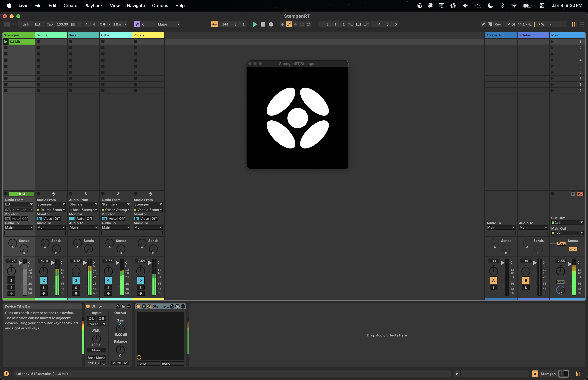

# StemgenRT

A real-time music source separation plugin. Drop it on a track and get 4 separate stems: drums, bass, other, and vocals.

This c91 listening build processes stereo audio in 512-sample hops and reports exactly 1,024 samples of latency (23.22 ms at 44.1 kHz) when the host is prepared at 44.1 kHz with a 512-sample callback. It is made for spatializing DJ sets in real time: split the mix into stems, place them in the room, and create an immersive experience.

> [!WARNING]
> The bundled model is the frozen, seamless c91 OLA graph, but the hardened two-hop plugin scheduler is an unqualified listening candidate. Its real-time audio callback never waits for inference; it falls back dry when the worker misses the result's following-callback due boundary. Test it on the target Mac; do not publish it as a qualified release yet.

Built with [JUCE](https://github.com/juce-framework/JUCE) and [ONNX Runtime](https://onnxruntime.ai), using [HS-TasNet](https://github.com/sweetspotsoundsystem/HS-TasNet).

Available as VST3 and AU.



## Usage

StemgenRT is a multi-output plugin with 4 stereo output buses:

1. **Drums**
2. **Bass**
3. **Other** (synths, guitars, etc.)
4. **Vocals**

To set it up:

1. Insert StemgenRT on your source track (e.g., a DJ mix or full song)
2. Create 4 auxiliary/bus tracks to receive each stem
3. Route each of the plugin's stem outputs to its corresponding aux track

Check your DAW's documentation for multi-output plugin routing.

> [!IMPORTANT]
> This listening build accepts exactly 44.1 kHz with a 512-sample prepared callback. Other configurations fail closed. The existing higher-rate bridge remains in the source for later qualification.

## Downloads

- [StemgenRT-macOS-AU.zip](https://github.com/sweetspotsoundsystem/stemgen-rt/releases/download/latest/StemgenRT-macOS-AU.zip)
- [StemgenRT-macOS-VST3.zip](https://github.com/sweetspotsoundsystem/stemgen-rt/releases/download/latest/StemgenRT-macOS-VST3.zip)
- [StemgenRT-Windows-VST3.zip](https://github.com/sweetspotsoundsystem/stemgen-rt/releases/download/latest/StemgenRT-Windows-VST3.zip)

> [!NOTE]
> CI seals the macOS bundles with an ad-hoc signature and verifies them strictly after embedding the model and ONNX Runtime. Ad-hoc signing is not Developer ID signing or notarization, so Gatekeeper may still reject a quarantined download. A public trusted release must be Developer ID signed and notarized.

## Building

First, grab the pinned official ONNX Runtime 1.26.0 dependency:

```bash
# macOS
./scripts/download-onnxruntime.sh

# Windows (PowerShell)
./scripts/download-onnxruntime.ps1
```

The provided macOS dependency is Apple Silicon (`arm64`) only, and StemgenRT targets macOS 14.0 or newer because that is the minimum encoded in Microsoft's official ONNX Runtime 1.26.0 dylib. Microsoft does not publish an Intel macOS archive for ONNX Runtime 1.26.0, so Intel macOS artifacts are not built or qualified. Windows downloads the SDK matching the native x64 or ARM64 PowerShell process.

The optional JUCE-generated VST3 `moduleinfo.json` is disabled on macOS because its build-time helper can block in `dyld` before plugin code is entered. The VST3 bundle remains host-scannable and is still sealed and strictly verified; Windows keeps the generated manifest.

Then build with CMake presets:

```bash
cmake --preset default
cmake --build --preset default
```

The two-hop asynchronous scheduler is not yet qualified for a public release. For local listening on macOS, use the default build and install it explicitly as a debug build:

```bash
./scripts/install-plugins.sh --debug
```

The release preset remains available for later qualification work and writes to `build-release`. It enables `STEMGENRT_REQUIRE_QUALIFIED_ORT`, which fails configuration unless the complete official 1.26.0 SDK is present. Do not treat a successful release build as model promotion.

On macOS, install the sealed AU and VST3 bundles into your user plugin directories with:

```bash
./scripts/install-plugins.sh
```

The installer uses Release artifacts by default, so this listening candidate must be selected with `./scripts/install-plugins.sh --debug`. Run `./scripts/install-plugins.sh --help` for signing and configuration options.

## How it works

The plugin runs a stateful HS-TasNet graph on a high-priority inference thread and uses a nonblocking asynchronous queue:

1. Callback N claims only a result already published for that boundary, preserves the native mix for Main/fallback, and submits one complete 512-sample request without waiting.
2. The inference thread carries previous-audio, overlap-add, and fusion-GRU state. For request N, c91 emits the separated result for input N-1.
3. The worker publishes that result for callback N+1. The audio thread renders it at host sample `(N + 1) * 512` and derives Other as the exact residual of the raw aligned mixture.

At 44.1 kHz both converters are bypassed with zero added delay and a bit-exact input copy. The preserved higher-rate bridge is disabled by this listening contract until it is requalified.

The model graph has four inputs and four outputs:

| Direction | Tensor | Shape |
| --- | --- | --- |
| Input | `audio_chunk` | `[1, 2, 512]` |
| Input | `past_audio` | `[1, 2, 512]` |
| Input | `overlap_add_buffer` | `[1, 4, 2, 1024]` |
| Input | `fusion_hidden` | `[2, 1, 1000]` |
| Output | `separated_chunk` | `[1, 4, 2, 512]` |
| Output | `next_past_audio` | `[1, 2, 512]` |
| Output | `next_overlap_add_buffer` | `[1, 4, 2, 1024]` |
| Output | `next_fusion_hidden` | `[2, 1, 1000]` |

All persistent state tensors start at zero. `separated_chunk` is aligned with the preceding call's `audio_chunk`. Sequence zero after reset is a successful pre-roll with `outputValid == false`; sequence one emits sequence zero with `outputValid == true`. One final zero input hop advances the graph to the last real hop. On a play-to-stop transition, the plugin defers reset until the following qualified 512-sample callback has claimed and rendered that result.

This listening build deliberately sends the unmodified finite input level into the graph. The former per-hop RMS boost was not part of the trained or frozen evaluation contract; deployment-path measurements showed that it modulated sub-bass and damaged drum and bass quality. Main and the residual use the same exact raw previous hop.

The c91 graph contributes one previous-hop delay and the asynchronous queue contributes one additional hop. Callback N supplies the lookahead needed to emit N-1, and the worker publishes that result for callback N+1, so PDC is exactly 1,024 samples. The worker has one recurring 512-sample interval—about 11.61 ms at 44.1 kHz—between submission and the result's due boundary; the real-time callback does not wait.

The preserved bridge can map the interval onto other exact rational host clocks and include paired SRC delay in PDC, but those paths are disabled until separately qualified.

### Mixture-lossless output

Within the deployment graph, drums, bass, and vocals retain their estimates at every level, and `Other` receives the exact residual. The native buses reproduce those estimates unchanged whenever model output is available and confidence is fully open:

```text
Other = Main - Drums - Bass - Vocals
```

The plugin enforces the same invariant after runtime-provider differences, during dry fallback, and through its near-silence safety fade, so the four stem buses sum to the latency-aligned main bus to floating-point precision. This means the separation is mixture-lossless; it does not mean the estimated stems are identical to unrecoverable studio-original recordings. Independent clipping, normalization, or PCM quantization downstream can also break exact summation.

The model path has no external gain normalization, crossover, low-frequency reinjection, vocals-specific gate, or chunk-boundary crossfade. Finite audio goes directly to the stateful graph, whose Hann-windowed overlap-add synthesis is internal.

The graph has a small, approximately level-independent floor in its individual stem estimates near silence. The final output stage therefore uses one stereo-linked peak envelope of the latency-aligned mixture to fade only the available model contribution. The envelope maps to fully enabled separation at and above -72 dBFS peak, fully disabled separation at and below -96 dBFS peak, and a smooth blend over the linear-amplitude interval between them. The detector opens immediately, holds peaks for 50 ms, then releases by 60 dB per 100 ms. Main and the dry underrun fallback are unchanged; as confidence falls, `Other` receives the residual.

Every processed hop is tagged with its exact output sample range. A result that misses its following-callback due boundary remains on the worker only long enough to preserve recurrent continuity, then is discarded when its range has elapsed; it is never replayed against newer audio. On missing samples StemgenRT uses the complete latency-aligned dry split and routes the mixture to `Other`. Transport starts, seeks, stopped scrubs, and loop wraps reset previous-audio, overlap-add, fusion-hidden, output-crossfade, confidence, queue epoch, and SRC phase state. The first successful result after reset is pre-roll; the next result is the first valid separated hop.

### Model identity

The plugin bundles one self-contained file: `model/model.onnx`. There is no companion `.onnx.data` file. It is the frozen c91 streaming artifact (SHA-256 `52fdc46d015819821dae19ef272b6bc4ccf441a0274d7d9c8bb44af50eafef8c`, 129,088,022 bytes). The authoritative artifact identity, checkpoint identity, tensor interface, streaming metadata, dimensions, residual index, and previous-hop alignment live in `cmake/QualifiedModelContract.cmake`.

The runtime validates the artifact, graph input/output contract, and embedded deployment metadata before enabling separation.

## CPU operation

CPU inference is the intended deployment path. Every worker wake, graph run, and publication must complete before the result's following-callback due boundary; claiming and output writing remain nonblocking. A native control on the research Ryzen measured the exact c91 ONNX at 3.84 ms mean, 6.01 ms p99, and 9.10 ms p99.9, but still saw 7 misses in 10,000 direct calls. That shows feasibility, not release qualification; repeat the complete path under DAW load on the target Mac.

Use a modern CPU, close competing real-time workloads, and watch the plugin's underrun diagnostics when qualifying a system. The shipping runtime is deliberately CPU-only so host hardware cannot silently select a different numerical or scheduling path.

To compare ONNX Runtime's CPU thread-pool size on a macOS Release build, run the disabled stateful sweep explicitly:

```bash
cmake --build --preset release --target AudioPluginTest
build-release/test/AudioPluginTest --gtest_also_run_disabled_tests \
  --gtest_filter=OrtStreamingRuntimeTest.DISABLED_BenchmarkStatefulCpuIntraOpThreadSweep
```

The sweep creates a fresh session for each 1–4 thread candidate and runs three order-balanced passes of 25 warmup plus 500 measured hops. It reports wall-clock percentiles, aggregate process CPU time, due-boundary misses, and the retained-stem numerical delta from the single-thread reference. The qualified Apple Silicon run selected three intra-op threads, so macOS production sessions cap the automatic policy at three. Windows retains the previous four-thread cap until the same target-platform qualification is completed there. Explicit benchmark overrides do not change either production policy.

### Target-Mac machine qualification

The complete fail-closed handoff is one command on a native Apple Silicon Mac running macOS 14 or newer. Give it a new evidence directory outside this source tree; it refuses a stale `build-release` tree and never installs, tags, publishes, or promotes the candidate:

```bash
./scripts/qualify-c91-macos.sh ../c91-mac-qualification-v1
```

For a modified candidate, first seal the exact tracked and untracked source bytes on the development machine. Transfer both generated files, verify `SHA256SUMS` before extraction, extract into a new empty directory, and run the qualifier there:

```bash
./scripts/package-c91-macos-handoff.sh ../c91-mac-handoff-v1
cd ../c91-mac-handoff-v1
shasum -a 256 -c SHA256SUMS
# After extracting into a new directory, pass the verified archive hash:
STEMGENRT_HANDOFF_ARCHIVE_SHA256=<archive-sha256> \
  ./scripts/qualify-c91-macos.sh /absolute/existing-parent/c91-mac-qualification-v1
```

The script authenticates the frozen c91 model, downloads the byte-pinned official ONNX Runtime 1.26.0 archive, makes a fresh arm64 Release build, runs the complete tests, strictly verifies both bundles, runs the direct CPU controls and thread sweep, then paces 100 warmups plus 10,000 measured callbacks through the full asynchronous `PluginProcessor` path. It fails on any due-boundary miss, audio-thread wait, underrun, queue/ring fault, unsafe callback, non-finite or non-distinct retained stem, reconstruction error above `1e-6`, missing worker priority, callback deadline miss, or declared memory-growth violation.

A pass is recorded only as `machine_pass_listening_pending_unpromoted`. Follow the generated `NEXT_STEPS.md` to install and validate the AU, run the actual DAW/load/listening checks, and submit the locked blind votes. CI builds test artifacts but has no publishing job. A future promotion workflow must verify the actual machine and listening receipts against the exact candidate bytes; receipt-shaped strings are not sufficient.

For an explicit CI machine run, add the `target-mac-qualification` label to a pull request. That opt-in job checks out the exact PR head, runs the same qualifier on an Apple-Silicon `macos-14` runner, and uploads the evidence even when a gate fails. It cannot install or publish a release.

The preserved multi-rate timing benchmark remains available for future qualification:

```bash
build-release/test/AudioPluginTest --gtest_also_run_disabled_tests \
  --gtest_filter=OrtStreamingRuntimeTest.DISABLED_BenchmarkStatefulCpuWithPreservedSampleRateBridges
```

Re-run the bridge and complete asynchronous due-boundary path before enabling any non-native rate.

### Streaming diagnostics

The Release editor keeps the logo and adds a lightweight health panel showing model status, active PDC, the prepared and current host block sizes, due-boundary misses, dry-fallback samples, callback-timing warnings, and inference-worker priority. A `PDC timing warning` means the host is delivering a callback size that needs more latency than the value established in `prepareToPlay`. StemgenRT does not change PDC from the audio thread or splice late model fragments into the output; it keeps Main latency-aligned and routes the complete mixture to Other until callback timing is safe again. Stop playback and make the host re-prepare the plugin at 44.1 kHz / 512 samples (or reload the plugin) before judging separation. Persistent dry fallback at that exact configuration means inference is missing its following-callback due boundary; reduce competing CPU load or use a faster target CPU.

## License

MIT
